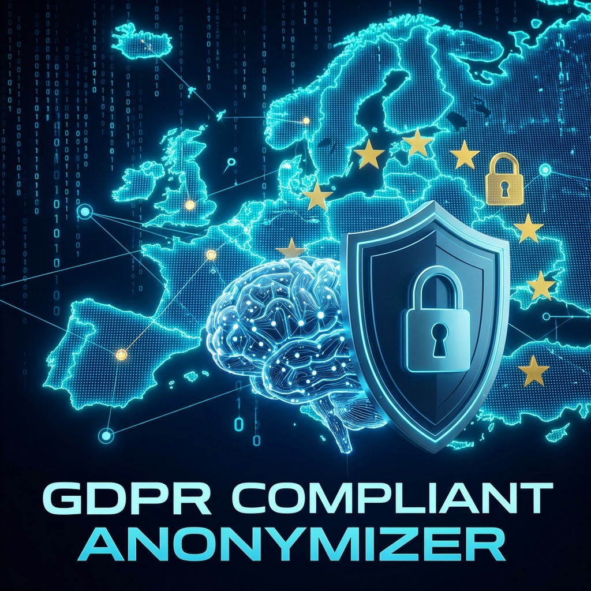
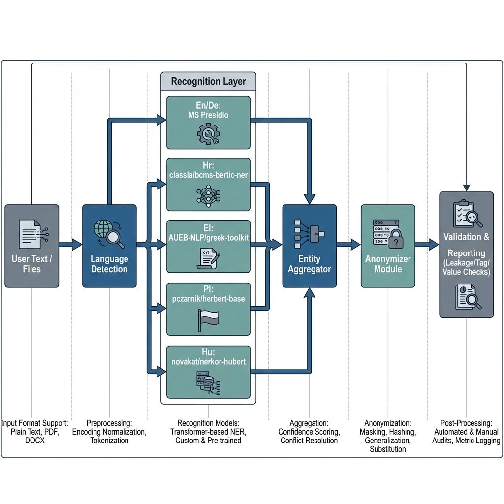

# 🛡️ Multilingual PII Anonymizer




[](https://www.python.org/)
[](https://microsoft.github.io/presidio/)
[]()

> A robust, multilingual Personal Identifiable Information (PII) detection and anonymization framework capable of handling complex entities across varied linguistic contexts using Microsoft Presidio and custom NER models.

---

## 📖 Overview

This project is a comprehensive solution for detecting and anonymizing sensitive information in unstructured text. It extends **Microsoft Presidio** with custom **Named Entity Recognition (NER)** models (Transformer-based) and regex patterns to support a wide range of PII entities across multiple languages.

### 🌟 Key Features

*   **Multilingual Support**: Specialized handling for English, German, Croatian (HR), Greek (EL), Hungarian (HU), Polish (PL), and more.
*   **Hybrid Detection**: Combines purely rule-based logic (RegEx) with state-of-the-art NLP models (BERT, Roberta, etc.).
*   **High Precision**: Fine-tuned logic to handle edge cases in address parsing, name recognition, and alphanumeric IDs (e.g., license plates).
*   **Extensible**: Modular architecture allows for easy addition of new languages and recognizers.

---

## 🔄 Workflow

 The following diagram illustrates the PII detection and anonymization pipeline:



---

## 🚀 Getting Started

### Prerequisites

*   Python 3.8+
*   Git

### Installation

1.  **Clone the Repository**
    ```bash
    git clone https://github.com/your-username/multilingual-pii-anonymizer.git
    cd multilingual-pii-anonymizer
    ```

2.  **Create a Virtual Environment**
    ```bash
    python -m venv venv
    source venv/bin/activate  # On Windows: venv\Scripts\activate
    ```

3.  **Install Dependencies**
    ```bash
    pip install -r requirements.txt
    ```

4.  **Download Language Models**
    The project relies on several Hugging Face models. You can clone them directly or let the pipeline download them on first run (if configured):
    ```bash
    # Example: Croatian Model
    git clone https://huggingface.co/classla/bcms-bertic-ner
    ```
    *(See `README.md` in `models/` or the source code for full list of model URLs)*

---

## 💻 Usage

### Basic Execution

To run the main PII detection pipeline:

```bash
python src/PIIDetector.py
```

### Running Tests

We have a suite of scripts for testing validity and performance:

```bash
# Run the Excel-based test runner
python test/prod_xlsx_final_runner.py
```

### Post-Processing Scripts

Utility scripts are located in the `scripts/` directory to help analyze results:

*   `scripts/leaked_flagsetting.py`: Checks for leaked PII in output.
*   `scripts/presidio_tag_flagsetting.py`: Verifies tag consistency.
*   `scripts/report_maker_misano_distr.py`: Generates a distribution report of anonymization performance.

---

## 📂 Project Structure

```text
├── src/
│   ├── models/           # Custom NER model wrappers and recognizers
│   ├── utils/            # Helper functions and constants
│   ├── PIIDetector.py    # Main entry point class
│   └── ...
├── scripts/              # Utilities for reporting, flag setting, and config
├── yaml/                 # Configuration files for different language testers
├── test/                 # Test runners and validity checkers
├── requirements.txt      # Project dependencies
└── README.md             # This file
```

---

## 🌍 Supported Languages & Models

| Language | Model Source |
| :--- | :--- |
| **Croatian** | [classla/bcms-bertic-ner](https://huggingface.co/classla/bcms-bertic-ner) |
| **Greek** | [AUEB-NLP](https://huggingface.co/spaces/AUEB-NLP/greek-nlp-toolkit-demo) |
| **Polish** | [pczarnik/herbert-base-ner](https://huggingface.co/pczarnik/herbert-base-ner) |
| **Hungarian** | [novakat/nerkor-cars-onpp-hubert](https://huggingface.co/novakat/nerkor-cars-onpp-hubert) |

---

## 🤝 Contributing

Contributions are welcome! Please open an issue or submit a pull request for any improvements or new language additions.

---

## 📄 License

[MIT](LICENSE)
