# 🔒 GDPR-Compliant Multilingual PII Anonymizer

A production-grade, **multilingual Personally Identifiable Information (PII) detection and anonymization pipeline** built for GDPR compliance. The system leverages **Microsoft Presidio**, **HuggingFace Transformers**, **spaCy**, and **Flair NLP** to detect and anonymize **27+ PII entity types** across **7 languages** with high accuracy.

---

## 🌟 Key Features

- **Multilingual Support** — Detects PII in **English, German, Croatian, Greek, Polish, Hungarian, and Montenegrin**
- **27+ PII Entity Types** — From names and emails to IBAN numbers, passports, and device identifiers
- **Language-Specific NER Models** — Fine-tuned transformer models for each supported language (BERTić, Herbert, NerKor, GR-NLP Toolkit)
- **YAML-Driven Configuration** — All entity patterns, regex rules, and context keywords are defined in extensible YAML configuration files
- **Custom Recognizers** — 13 purpose-built recognizers for domain-specific entities (billing numbers, IMEI, network addresses, etc.)
- **Context-Aware Scoring** — Confidence scores are boosted when surrounding context keywords match (e.g., "phone number" near a digit pattern)
- **Instance-Counting Anonymization** — Replaces PII with indexed placeholders (e.g., `<PERSON_0>`, `<EMAIL_1>`) preserving referential consistency
- **Deanonymization Support** — Reversible anonymization with entity mapping for data recovery
- **Streamlit Web Interface** — Interactive web application for real-time PII detection and anonymization
- **Comprehensive Evaluation Framework** — Tag accuracy, value accuracy, leakage detection, and mis-anonymization distribution reporting

---

## 🏗️ System Architecture

The pipeline is composed of multiple layers working together to provide high-accuracy, multilingual PII detection:

```mermaid
flowchart TD
    A["📝 Input Text"] --> B["🌐 Language Detection"]
    B --> C["🧠 NER Model Selection"]
    C --> D["Presidio Analyzer Engine"]

    D --> E["spaCy NER Models"]
    D --> F["Flair NER Models"]
    D --> G["HuggingFace Transformer Models"]
    D --> H["Custom Regex Pattern Recognizers"]

    E --> I["Recognizer Registry"]
    F --> I
    G --> I
    H --> I

    I --> J["Context-Aware Enhancer"]
    J --> K["Entity Analysis Results"]
    K --> L["Instance Counter Anonymizer"]
    L --> M["🔒 Anonymized Output"]
    M --> N["📊 Evaluation & Reporting"]

    subgraph NER_Models["Language-Specific NER Models"]
        G1["BERTić — Croatian/Montenegrin"]
        G2["GR-NLP Toolkit — Greek"]
        G3["Herbert — Polish"]
        G4["NerKor — Hungarian"]
    end

    G --> NER_Models

    subgraph Custom_Recognizers["13 Custom Pattern Recognizers"]
        CR1["Phone, Email, URL"]
        CR2["IBAN, Credit Card, SSN"]
        CR3["IMEI, IP Address, MAC"]
        CR4["Billing Nr, IAN, Network"]
    end

    H --> Custom_Recognizers
```



### Architecture Layers

| Layer | Component | Role |
|-------|-----------|------|
| **Input Processing** | Language Detector | Identifies the language of the input text |
| **NER Detection** | spaCy, Flair, HuggingFace models | Named Entity Recognition for persons, locations, organizations |
| **Pattern Matching** | Custom Regex Recognizers | Detects structured PII (emails, IBANs, phone numbers, etc.) |
| **Context Enhancement** | Custom Context Enhancer | Boosts confidence scores using surrounding keywords |
| **Anonymization** | Instance Counter Anonymizer | Replaces PII with indexed, reversible placeholders |
| **Post-Processing** | Numerical Placeholder Replacer | Handles domain-specific placeholder formatting |
| **Evaluation** | Report Generator | Computes tag/value accuracy, leakage rates, and mis-anonymization distributions |

---

## 🌍 Supported Languages & NER Models

| Language | Code | NER Model | Model Type | Source |
|----------|------|-----------|------------|--------|
| **English** | `en` | spaCy `en_core_web_lg` + Flair | spaCy / Flair | Built-in |
| **German** | `de` | spaCy `de_core_news_lg` + Flair | spaCy / Flair | Built-in |
| **Croatian** | `hr` | [`classla/bcms-bertic-ner`](https://huggingface.co/classla/bcms-bertic-ner) | HuggingFace Transformer | Fine-tuned BERT |
| **Greek** | `el` | [`AUEB-NLP/greek-nlp-toolkit-demo`](https://huggingface.co/spaces/AUEB-NLP/greek-nlp-toolkit-demo) | GR-NLP Toolkit | Specialized Greek NLP |
| **Polish** | `pl` | [`pczarnik/herbert-base-ner`](https://huggingface.co/pczarnik/herbert-base-ner) | HuggingFace Transformer | Fine-tuned Herbert |
| **Hungarian** | `hu` | [`novakat/nerkor-cars-onpp-hubert`](https://huggingface.co/novakat/nerkor-cars-onpp-hubert) | HuggingFace Transformer | Fine-tuned HuBERT |
| **Montenegrin** | `cnr` | Mapped to Croatian BERTić model | HuggingFace Transformer | Shared with Croatian |

Each language uses its own spaCy model for tokenization and base NER, with HuggingFace transformer models providing additional language-specific entity recognition.

---

## 🏷️ Detected PII Entity Types

The system detects **27+ entity types** across three recognition categories:

### NER-Based Entities (via Transformer & spaCy Models)

| Entity Type | Description |
|-------------|-------------|
| `PERSON` | Full names of individuals |
| `LOCATION` / `STREET` | Physical addresses, street names, cities |
| `ORGANIZATION` | Company and organization names |
| `DATE` | Date expressions and temporal references |
| `MISC` | Miscellaneous named entities |

### Pattern-Based Entities (via Regex Recognizers)

| Entity Type | Description |
|-------------|-------------|
| `EMAIL_ADDRESS` | Email addresses |
| `PHONE_NUMBER` | International and local phone numbers |
| `IBAN` | International Bank Account Numbers |
| `CREDIT_CARD` | Credit/debit card numbers |
| `SSN` | Social Security Numbers (US and EU variants) |
| `IP_ADDRESS` | IPv4 and IPv6 addresses |
| `MAC_ADDRESS` | Network device MAC addresses |
| `URL` | Web URLs and links |
| `IMEI` | Mobile device IMEI numbers |
| `GPS_COORDINATES` | Latitude/longitude coordinates |
| `ZIP_CODE` | Postal/ZIP codes |
| `BILLING_NR` | Billing and account numbers |
| `INTERNET_ACCESS_NUMBER` | ISP access identifiers |
| `CUSTOMER_ACCOUNT` / `CUSTOMER` | Customer identifiers |
| `BOOKING_ACCOUNT` | Booking reference numbers |
| `CARD_PROFILE_NR` | Card profile identifiers |
| `TAX_IDENTIFICATION_NUMBER` | Tax IDs |
| `SOCIAL_MEDIA_HANDLE` | Social media usernames |
| `OIB` | Croatian/Montenegrin personal ID numbers |
| `DRIVER_LICENSE` | Driver's license numbers |

### Passport Variants (Multi-Country)

| Entity Type | Countries Covered |
|-------------|-------------------|
| `PASSPORT` | India, USA, Italy, Canada, France, Germany, Sweden, UK, Austria, Russia |
| `GERMAN_VISA` / `CROATIAN_VISA` | Country-specific visa numbers |

---

## ⚙️ How It Works — Pipeline Methodology

### Stage 1: Language Detection & Configuration
The system accepts input text and determines its language. Based on the detected language, it loads the appropriate YAML configuration file containing language-specific regex patterns, context keywords, and entity definitions.

### Stage 2: Multi-Model NER Analysis
The text is simultaneously processed by multiple NER engines:
- **spaCy** — For tokenization and base entity recognition
- **Flair** — For sequence labeling-based NER (English/German)
- **HuggingFace Transformers** — Language-specific fine-tuned models (BERTić, Herbert, NerKor, GR-NLP)

### Stage 3: Custom Pattern Recognition
13 purpose-built pattern recognizers scan the text using regex patterns defined in YAML configuration files. Each pattern recognizer includes:
- **Regex patterns** with confidence scores
- **Context keywords** that boost detection confidence when found near potential matches
- **Language-specific variants** for multilingual support

### Stage 4: Context-Aware Confidence Enhancement
A custom `LemmaContextAwareEnhancer` analyzes the surrounding text (10 words before, 5 words after) for context keywords. When relevant context is found, the entity's confidence score is boosted (similarity factor: 0.35, minimum score with context: 0.7).

### Stage 5: Instance-Counting Anonymization
Detected PII entities are replaced with indexed placeholders using a custom `InstanceCounterAnonymizer`:

```
Input:  "John Doe called Jane Smith at john@email.com"
Output: "<PERSON_0> called <PERSON_1> at <EMAIL_ADDRESS_0>"
```

This approach:
- Preserves **referential consistency** — the same entity always maps to the same placeholder
- Enables **deanonymization** — original values can be recovered using the entity mapping
- Maintains **text structure** — sentence structure and readability are preserved

### Stage 6: Post-Processing
Numerical placeholders are optionally replaced with domain-specific formatting defined in the YAML configuration.

---

## 📊 Evaluation & Testing Framework

The project includes a comprehensive evaluation pipeline for measuring anonymization quality:

### Evaluation Metrics

| Metric | Description |
|--------|-------------|
| **Tag Accuracy (TP)** | Percentage of PII entities correctly identified and anonymized |
| **Tag Mis-anonymization (FN)** | Percentage of entities detected but assigned the wrong entity type |
| **Value Accuracy** | Percentage of entities where the exact value boundaries were correctly captured |
| **Value Mis-anonymization** | Entities where the value was partially or incorrectly captured |
| **Leakage Rate** | Percentage of PII entities that were not detected and remained in the output |
| **Mis-anonymization Distribution** | Breakdown of which entity types are most commonly confused with each other |

### Testing Methodology

1. **Test Case Generation** — Valid and invalid test cases are generated for each entity type using pattern-based generation from regex definitions
2. **Multilingual Query Simulation** — Test queries are written in both English and the target language, simulating real-world chatbot interactions
3. **Batch Processing** — Test cases are loaded from Excel files and processed in bulk via automated test runners
4. **Three-Phase Post-Processing**:
   - **Leaked Flag Setting** — Identifies PII entities that were not detected (leaked through)
   - **Tag Flag Setting** — Evaluates whether detected entities received the correct entity type label
   - **Value Flag Setting** — Evaluates whether the correct text span was captured for each entity
5. **Report Generation** — Final mis-anonymization distribution reports are generated showing per-entity accuracy breakdowns for both valid and invalid test cases

### Evaluation Results Structure

The evaluation produces per-entity reports with the following breakdown:

| Category | Metrics Reported |
|----------|-----------------|
| **Valid Cases** | Occurrences, Tag TP, Tag FN, Tag Mis-anonymization Distribution, Value TP, Value FN, Value Mis-anonymization Distribution, Leaked Count, All Accuracy % |
| **Invalid Cases** | Same metrics as valid, evaluated on intentionally malformed inputs to measure false positive rates |

---

## 🛠️ Tech Stack

| Technology | Purpose |
|------------|---------|
| [Microsoft Presidio](https://microsoft.github.io/presidio/) | Core PII detection and anonymization framework |
| [HuggingFace Transformers](https://huggingface.co/docs/transformers/) | Language-specific NER models |
| [spaCy](https://spacy.io/) | Tokenization, NLP pipelines, and base NER |
| [Flair NLP](https://github.com/flairNLP/flair) | Sequence labeling NER for English/German |
| [GR-NLP Toolkit](https://github.com/nlpaueb/gr-nlp-toolkit) | Greek language NLP processing |
| [Streamlit](https://streamlit.io/) | Interactive web application UI |
| [YAML](https://yaml.org/) | Configuration-driven entity pattern definitions |
| Python | Core implementation language |
| Pandas | Data processing, test case management, and report generation |

---

## 🛡️ GDPR Compliance Features

This system is designed to support GDPR (General Data Protection Regulation) compliance requirements:

| GDPR Requirement | How This System Addresses It |
|-------------------|------------------------------|
| **Data Minimization** (Art. 5) | Detects and removes PII from text data, ensuring only necessary information is retained |
| **Right to Erasure** (Art. 17) | Anonymization removes personal data from processed text |
| **Data Protection by Design** (Art. 25) | Configurable entity detection with YAML-driven rules ensures comprehensive PII coverage |
| **Cross-Border Data Transfer** (Art. 44-49) | Multilingual support ensures PII is detected regardless of the language used |
| **Pseudonymization** (Art. 4) | Instance-counting anonymization creates consistent, reversible pseudonyms |
| **Accountability** (Art. 5) | Detailed logging and evaluation reports provide audit trails for compliance verification |

---

## 📁 Project Structure (Development)

```
├── app.py                          # Streamlit web application
├── src/
│   ├── PIIDetector.py              # Core detection orchestrator
│   ├── models/
│   │   ├── _presidio.py            # Presidio analyzer engine wrapper
│   │   ├── _bertic_recognizer.py   # Croatian/Montenegrin BERTić NER
│   │   ├── _gr_nlp_toolkit_recognizer.py  # Greek NER
│   │   ├── _herbert_recognizer.py  # Polish Herbert NER
│   │   ├── _nerkor_hu.py           # Hungarian NerKor NER
│   │   ├── __spacy_recognizer.py   # spaCy NER wrapper
│   │   ├── __flair_recognizer.py   # Flair NER wrapper
│   │   ├── __base_models.py        # Base transformer model class
│   │   └── custom_recognizers/     # 13 regex-based recognizers
│   └── utils/
│       ├── constants.py            # Entity type constants and paths
│       ├── model_loader.py         # Dynamic model discovery
│       ├── config_combiner.py      # Multi-language config merger
│       └── custom_regex_loader.py  # YAML pattern parser
├── yaml/                           # Language-specific config files
├── test/                           # Test runners and evaluation scripts
└── requirements.txt                # Python dependencies
```

---

## 👥 Authors

**Preet Mhala**

---

## 📄 License

This project is developed for research and enterprise PII protection purposes.
